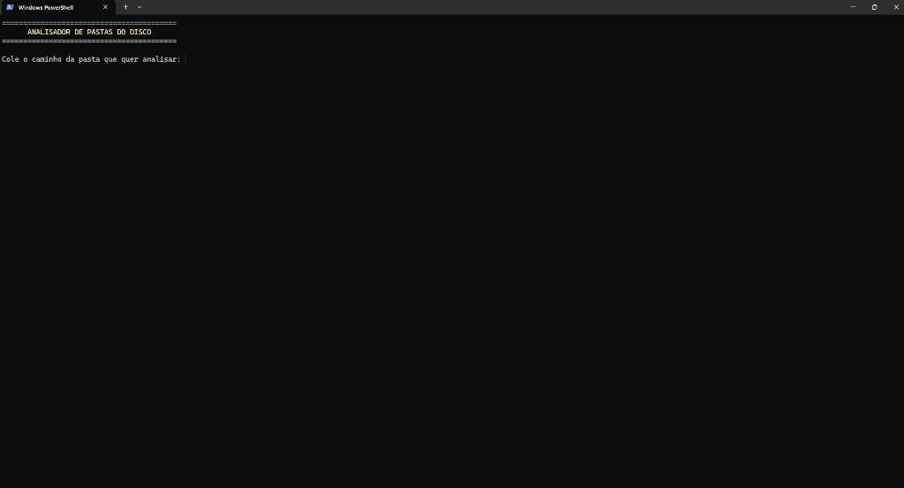
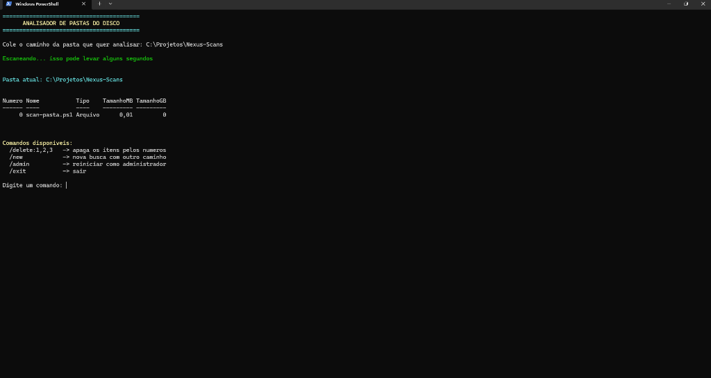

# <p align="center"></p>

# <p align="center">Nexus Scans - Analisador de Pastas</p>

<p align="center">
  
  
  
</p>

O **Nexus Scans** é uma ferramenta industrial de análise de disco desenvolvida em PowerShell. Ele permite escanear diretórios complexos, identificar gargalos de armazenamento e realizar limpezas seguras através de uma interface CLI otimizada e integrada ao Windows.

---

## ✨ Funcionalidades Principais

- 🔍 **Análise Profunda:** Varredura completa de arquivos e pastas com cálculo de tamanho recursivo.
- 📊 **Ordenação Inteligente:** Resultados apresentados automaticamente do maior para o menor item.
- 🗑️ **Deleção via Sistema Windows:** Integração direta com a API do Windows para enviar arquivos à Lixeira. Isso garante que você use a interface nativa do sistema para confirmar a exclusão, trazendo mais segurança e familiaridade.
- 🛡️ **Elevação de Privilégios:** Comando `/admin` integrado para reiniciar o script com direitos de Administrador instantaneamente.
- 🚀 **Feedback Visual:** Barra de progresso nativa para acompanhar escaneamentos de grandes volumes de dados.

---

## 📸 Screenshots

### 1. Inicialização e Seleção de Caminho
A interface solicita o caminho da pasta de forma clara e intuitiva.
<p align="center">
  
</p>

### 2. Resultados e Gerenciamento
Exibição detalhada dos tamanhos em MB/GB e lista de comandos disponíveis.
<p align="center">
  
</p>

---

## 🛠️ Comandos Disponíveis

| Comando | Descrição |
| :--- | :--- |
| `/delete:1,2,3` | Apaga os itens selecionados pelos números da lista. |
| `/new` | Inicia uma nova análise em um caminho diferente. |
| `/admin` | Reinicia o script como Administrador. |
| `/exit` | Encerra a aplicação. |

---

## 🚀 Como Executar

1. Certifique-se de que a política de execução do PowerShell permite scripts (`Set-ExecutionPolicy RemoteSigned -Scope CurrentUser`).
2. Execute o script `scan-pasta.ps1` de qualquer local.
3. **Flexibilidade Total:** O script solicitará que você cole o caminho da pasta que deseja analisar, não sendo necessário estar no diretório do projeto.
   ```powershell
   .\scan-pasta.ps1
   ```

---

## ⚖️ Licença

Este projeto está sob a licença **MIT**. Veja o arquivo [LICENSE](LICENSE) para mais detalhes.

---

<p align="center">
  Desenvolvido com ❤️ por <b>ONeithan</b><br>
  <i>Parte do Ecossistema Nexus</i>
</p>
